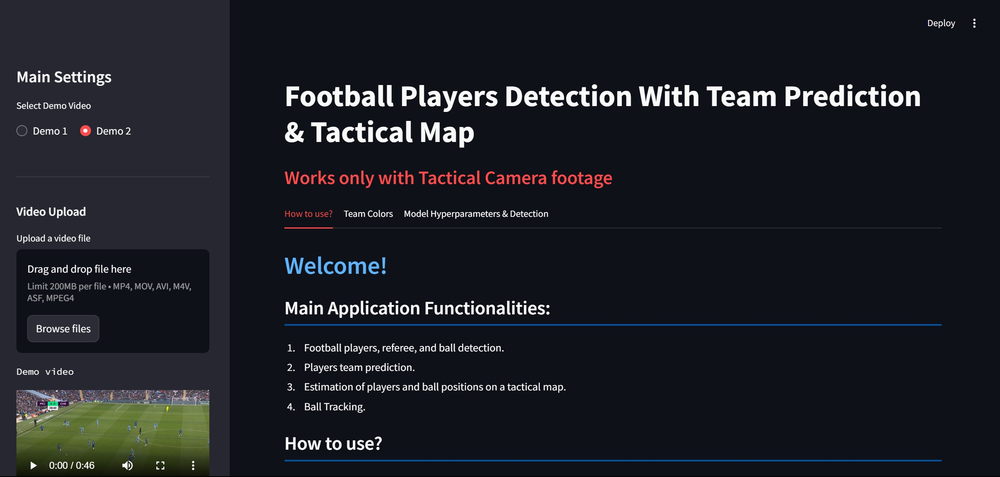
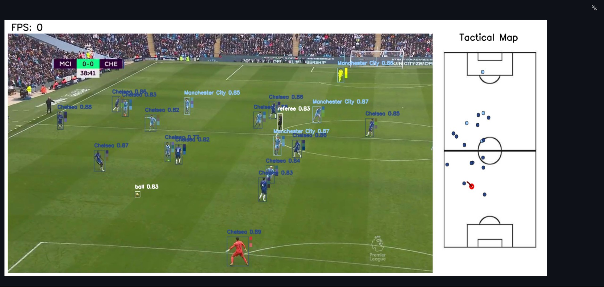

# Football Analysis using Computer Vision with Yolov8 & OpenCV

## 📖 Project Overview
This project leverages **deep learning** techniques for **football video analysis**, focusing on tracking players and the ball during a match. Using **Yolov8** for object detection and **OpenCV** for computer vision tasks, this application extracts player and ball coordinates, projects them onto a tactical map, and provides real-time insights for football analysis.

## ✨ Features
- **Player and Ball Detection**: Detect players, referees, and the ball from football game footage.
- **Tactical Map Projection**: Map player and ball coordinates onto a tactical map using homography transformation.
- **Team Affiliation Prediction**: Identify teams based on color analysis and assign players accordingly.
- **Real-time Analysis**: Frame-by-frame tracking of player movements and ball trajectory for real-time insights.

## 🧑‍💻 Technologies Used
- **Deep Learning Model**: [YOLOv8](https://yolov8.com/) (You Only Look Once - Version 8) for object detection.
- **Computer Vision Library**: [OpenCV](https://opencv.org/) for video processing and homography matrix calculations.
- **Programming Language**: Python.
- **Other Libraries**:
  - **Numpy**: For numerical computations.
  - **Pandas**: For data manipulation and analysis.
  - **Scikit-learn**: For clustering algorithms in team prediction.
  - **Matplotlib**: For plotting and visual representation.
  
## ⚙️ Algorithms and Techniques
- **Object Detection**: Uses **YOLOv8** for detecting players, referees, and the ball from football match videos.
- **Homography Transformation**: Calculates a **homography matrix** to map player and ball positions from the video frame to a tactical map.
- **Team Prediction Algorithm**: Uses **color analysis** to predict which team each player belongs to, based on dominant colors in the player's uniform.
- **Clustering Algorithm**: Implements **K-means clustering** to assist in team prediction by grouping players based on color similarities.

## 🚀 How It Works
1. **Data Input**: Input football match video recordings into the system.
2. **Object Detection**: Yolov8 detects players, referees, and the ball.
3. **Coordinate Projection**: The detected objects' coordinates are projected onto a tactical map using a homography transformation.
4. **Team Identification**: The color of each player is analyzed, and a team is assigned based on the dominant color palette extracted from the player's uniform.
5. **Visualization**: The processed data is displayed as real-time updates on the tactical map.

## 📊 Datasets
The project uses a **custom dataset** of football videos with annotated player and ball positions. The dataset is manually labeled to train the YOLOv8 model for better performance on player and ball detection.

## 💡 Challenges
- **Class Imbalance**: The ball appears less frequently than players in the dataset, causing detection difficulties.
- **Camera Movement**: Sudden changes in the video frame (due to camera movements) can affect detection and homography transformations.
- **Team Differentiation**: Accurately separating players of opposing teams in similar lighting conditions and from distant camera angles is challenging.

## 🛠️ Installation and Setup
1. Clone this repository:
   ```bash
   git clone https://github.com/yourusername/football-analysis-yolov8
   cd football-analysis-yolov8
   ```
2. Install the necessary dependencies:
   ```bash
   pip install -r requirements.txt
   ```
3. Download the Yolov8 weights:
   - You can find the pre-trained weights on the [Ultralytics GitHub page](https://github.com/ultralytics/ultralytics) or train your custom model.

4. Run the project:
   ```bash
   streamlit run main.py
   ```

## 🖼️ Screenshots

### 1. Homepage


### 2. Color Prediction


### 3. Model Hyperparameters Configuration


### 4. Final Output



## 🤝 Collaborators
This project was made possible with the contributions of the following collaborators:
- [Riya-jalan](https://github.com/Riya-jalan)
- [Nish-037](https://github.com/Nish-037)
- [Sameeksha0329](https://github.com/Sameeksha0329)

